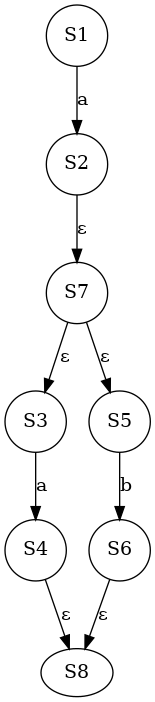

# Regular Expression to State Machine

This Python project is a tool for generating a nondeterministic state machine and a deterministic state machine from a regular expression provided by the user.

## How to Use

Clone the repository to your local machine:

    git clone https://github.com/AhmedMaher309/Regular-Expression-to-NFA-and-DFA.git

Navigate to the project directory and install the required dependencies with:

    pip install -r requirements.txt

To run the tool, execute the following command:

    python regex_state_machine.py

You will be prompted to enter a regular expression. Once you have entered a valid regular expression, the tool will generate a nondeterministic state machine and a deterministic state machine.

## Examples

Here are some examples of regular expressions you can try:

    (a|b)*
    a*b+
    a.b.c
    a(b|c)+d

## Screenshots

